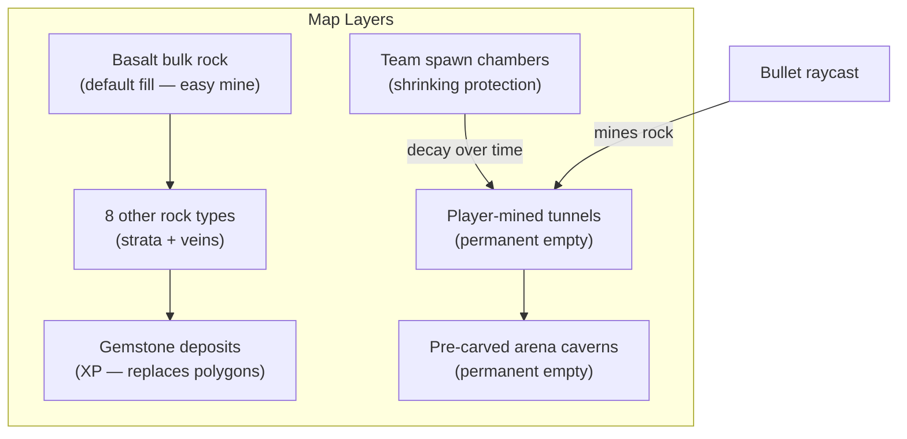
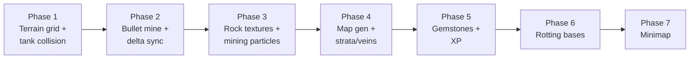

# Dig Wars: digdig.io × arras.io Team Mode

## The core fantasy

Players are tanks buried inside one enormous **rock mass**. Shooting **mines** tunnels through stone — not dirt. The default bulk material is **Basalt** (the "dirtrock" — common, easy to mine, no XP). Deeper and rarer **rock strata** and **veins** offer harder stone, some of which grant XP when broken. **Gemstones** embedded in the rock replace polygons as the main XP source. Teams start in hidden underground chambers on opposite sides. Over time, spawn protection rots away so campers can't sit outside a fixed base forever. Large pre-carved **arena caverns** (permanent empty space) become the main fight zones; the rock between them is the strategic layer — mine toward enemies, flank through tunnels, ambush from new holes, and hunt gems along the way.



---

## Rock types (9 geological materials)

The map is **one continuous rock body**, not a flat-colored background. Each terrain cell has a **rock type** that controls visual pattern, mine hardness, and whether breaking it grants XP.

| # | Rock | Color | Visual pattern | Role |
|---|------|-------|----------------|------|
| 1 | **Limestone** | Cream | Smooth horizontal layers | Soft strata; easy mine |
| 2 | **Sandstone** | Orange | Wavy horizontal stripes | Soft strata; easy mine |
| 3 | **Granite** | Gray-pink | Speckled dots | Medium hardness |
| 4 | **Slate** | Blue-gray | Thin plate lines | Medium hardness |
| 5 | **Basalt** | Charcoal | Cracked surface | **Default bulk fill ("dirtrock")** — most common, easiest to mine, no XP |
| 6 | **Marble** | White | Curvy veins | Medium-hard; optional small XP on break |
| 7 | **Obsidian** | Black | Sharp glassy shards | Hard to mine; border/structural |
| 8 | **Amethyst Geode** | Purple | Crystal clusters | Hard; grants XP when mined |
| 9 | **Malachite** | Emerald green | Circular bands | Medium-hard; grants XP when mined |
| 10 | **Pyrite** | Gold | Blocky crystals | Medium; grants XP when mined |

> Note: 9 named rock types plus Basalt as the 10th bulk material — Basalt is the universal "dirtrock" equivalent.

### Mine hardness (tune in playtest)

| Tier | Rocks | Hits to break (per cell) | XP on break |
|------|-------|--------------------------|-------------|
| **Soft** | Limestone, Sandstone, Basalt | 1 | No (Basalt); Limestone/Sandstone TBD |
| **Medium** | Granite, Slate, Marble, Pyrite | 2 | Pyrite yes; others TBD |
| **Hard** | Malachite, Amethyst Geode | 3 | Yes |
| **Very hard** | Obsidian | ∞ (indestructible) | No — bedrock borders, arena pillars |

### Visual rendering per rock type

Each rock type is **not** a flat fill. Client `terrainRenderer.js` draws per-cell using:

- **Base palette** — rock-specific color from table above
- **Procedural pattern** — layers, stripes, speckles, veins, cracks, etc. keyed to rock type ID + cell (x,y)
- **Edge faces** — on mine, exposed neighbor cells get 1px highlight/shadow on the cave lip
- **Tunnel interior** — very dark (`#1a1a1a`) so carved space reads as a cave
- **Mining particles** — rock-colored chips burst along bullet path; harder rocks = bigger/dimmer chips; gem veins = tinted sparkle on break

---

## Gemstones (replace polygons as XP source)

**Polygons are disabled** in Dig Wars. XP comes primarily from **gemstones** embedded in the rock — either pre-placed in veins during map gen or revealed when adjacent rock is mined.

| Gemstone | Color | Notes |
|----------|-------|-------|
| **Topaz** | Yellow | Common |
| **Aquamarine** | Cyan | Common |
| **Amethyst** | Purple | Uncommon |
| **Emerald** | Green | Uncommon |
| **Sapphire** | Blue | Rare |
| **Tanzanite** | Indigo | Rare |
| **Ruby** | Red | Very rare |
| **Opal** | White rainbow | Very rare; iridescent render |
| **Alexandrite** | Teal-purple | Very rare |
| **Painite** | Dark red-brown | Rarest |

**XP values:** TBD in playtest. Structure mirrors classic polygon tiers (common → rare → legendary) but exact numbers not decided yet.

### Gemstone mechanics

- Spawn as **entities** inside solid rock cells (hidden until rock around them is mined) or in gem-rich veins (Amethyst Geode / Malachite / Pyrite rock zones)
- When the enclosing cell is cleared, gemstone becomes visible and collectible (walk over / shoot to claim — TBD)
- Reuse Arras2 food/polygon pickup pipeline where possible ([`server/game/index.js`](server/game/index.js) `foodloop`, entity XP grant) with new definitions in [`server/lib/definitions/groups/food.js`](server/lib/definitions/groups/food.js) or a new `gemstones.js` group
- `enable_food: false` (or Dig Wars override); gem spawn cap replaces `food_cap`
- Some rock types (Amethyst Geode, Malachite, Pyrite) can drop bonus gems or XP directly on cell break in addition to embedded deposits

---

## What you have today (and what changes)

| Existing system | Reuse | Change |
|-----------------|-------|--------|
| TDM team balancing ([`server/loaders/global.js`](server/loaders/global.js) `getWeakestTeam`) | Yes | Same team assignment |
| Minimap teammates ([`server/game/network/sockets.js`](server/game/network/sockets.js) `minimapTeams`) | Yes | Add base marker + mined-terrain overlay |
| Corner base tiles ([`server/game/roomSetup/rooms/room_tdm.js`](server/game/roomSetup/rooms/room_tdm.js)) | No | Replace with buried chambers in terrain generator |
| `baseProtector` + `teamCheck` ([`server/game/roomSetup/tiles/teams.js`](server/game/roomSetup/tiles/teams.js)) | Partially | Replace tile-kill zones with timed shell decay |
| Wall entity collision ([`server/miscFiles/collisionFunctions.js`](server/miscFiles/collisionFunctions.js)) | No | New grid-based terrain collision |
| Polygon / food XP ([`server/config.js`](server/config.js) `food_types`, `enable_food`) | Partially | Replace with gemstone entities + mine XP from select rocks |
| DigDig WIP ([`server/lib/definitions/groups/dev/testing.js`](server/lib/definitions/groups/dev/testing.js)) | Cosmetic only | Defer class powers to post-MVP |

**Key architectural fact:** Arras2 has no destructible terrain. Walls are entities; the floor is static colored tiles. Dig Wars needs a **new authoritative pixel grid** with per-cell rock type + optional HP — this is the largest piece of work.

---

## Terrain model (true pixels, ~8 world units/cell)

**Why 8 units:** Default map is 15×15 tiles × 420 units = **6300×6300** world units → **787×787 cells** (~620k bytes for type array; optional second array for cell HP). Fine for server memory; chunk sync stays manageable.

### Cell types (`Uint8` enum)

| Value | Name | Behavior |
|-------|------|----------|
| 0 | `empty` | Passable; permanent once mined |
| 1–10 | `rock_*` | One of the 9 rock types + basalt (see rock table); solid, mineable per hardness table |
| 11 | `bedrock` | Indestructible Obsidian-equivalent (map borders, arena pillars) |
| 12 | `base_shell` | Team spawn outer wall; converts to mineable basalt on decay timer |
| 13 | `base_core` | Inner spawn safe zone; converts to mineable basalt on later timer |
| 14 | `arena` | Pre-carved fight space; always empty, never fillable |
| — | `gem_hidden` | (Optional) flag or parallel grid marking gemstone entity under cell |

**Per-cell data:**
- `type` — rock type ID (Uint8)
- `hp` — remaining mine hits (Uint8, only for multi-hit rocks; basalt/soft = 1)

**Rules:**
- Mining is **one-way** — empty cells stay empty (permanent tunnels).
- No entity-per-pixel; collision is **grid lookup + swept tests**.
- **Basalt** fills ~70–80% of the map as the common "dirtrock" bulk.

### New server module

Create [`server/game/terrain/terrainGrid.js`](server/game/terrain/terrainGrid.js):

- `get(x, y)`, `set(x, y, type, hp)`, `isSolid(x, y)`, `getHardness(x, y)`
- `raycastMine(origin, dir, maxDist, digPower)` — Bresenham/DDA through cells; apply damage per rock hardness; clear on break; emit gem reveal events
- `circleBlocked(cx, cy, radius)` — tank movement
- `getChunk(cx, cy)` / `applyDelta(chunkId, cells)` — network sync
- Chunk size: **32×32 cells** (~25×25 chunks for full map)

---

## Map generation (replaces `room_tdm` grid bases)

New room file: [`server/game/roomSetup/rooms/room_dig_wars.js`](server/game/roomSetup/rooms/room_dig_wars.js)

Macro layout stays a coarse tile grid (mostly `normal`), but `INIT` fills the **terrain grid** instead of placing visible base strips:

1. **Fill entire map with Basalt** (default bulk rock — the "dirtrock")
2. **Paint geological strata** — horizontal bands of Limestone, Sandstone, Granite, Slate at different depths (procedural noise for natural boundaries)
3. **Inject veins** — localized blobs/paths of Marble, Malachite, Amethyst Geode, Pyrite (gem-rich zones)
4. **Place hidden gemstones** — scatter gem entities in veins and randomly in medium/hard rock; density TBD
5. **Carve 3–5 arena caverns** in the center band (radius ~400–600 units). Mark cells `arena`.
6. **Connect arenas** with 2–3 narrow pre-carved corridors (`arena` type) — permanent fight patches.
7. **Per team** (2-team default: left/right halves):
   - Carve a spawn chamber (~250 unit radius hollow) at map edge, deep in rock
   - Ring it with `base_shell` (1-cell-thick shell at ~350 unit radius)
   - Inner disc = `base_core` (~150 unit radius) — actual spawn point in center
8. **Border ring** of `bedrock` (Obsidian) at map edge (prevents mining out of bounds)
9. Scatter `bedrock` pillars inside arenas for cover

Spawn selection: [`getSpawnableArea`](server/loaders/global.js) samples random points inside team's `base_core` hollow (reject if solid).

---

## Bullet mining (core combat loop)

In [`server/game/index.js`](server/game/index.js) gameloop, **before** entity HashGrid collision:

```
for each bullet this tick:
  prevPos → currPos raycast through terrainGrid
  for each solid rock cell along path:
    apply dig damage based on bullet power vs rock hardness
    if cell breaks:
      clear cell (empty)
      if gem hidden underneath → reveal/spawn gemstone entity
      if rock type grants XP → award XP to shooter
      queue chunk delta for broadcast
  bullet destroyed after mining (MVP — per current wall behavior)
```

Reuse the spirit of [`mazewallcollidekill`](server/miscFiles/collisionFunctions.js) (bullets die on environment hit) but terrain is the damage target, not wall entities.

**Mine visual (required for feel):**
- Client receives chunk deltas → redraw terrain pixels → transparent tunnel with dark interior
- **Full bullet path** carved per tick (not single cell) — tunnel opens along shot line
- **Rock-colored chip particles** (2–4 per broken cell) burst along bullet angle; color matches rock type
- **Edge face update** on adjacent solid cells (1px highlight/shadow on cave lip)
- Gem reveal: brief sparkle burst when gemstone uncovered

---

## Tank collision vs rock

Replace wall push for terrain with circle-vs-grid:

- Sample occupied cells in bullet/tank AABB
- Push tank out of nearest solid cell (similar to `mazewallcollide` push logic)
- Tanks **cannot** mine by ramming in MVP (only bullets mine) — keeps smasher from breaking the mode

Touch [`entity.js`](server/game/entities/entity.js) `confinementToTheseEarthlyShackles` only for map bounds; terrain blocking is a separate pass.

---

## Rotting bases (anti spawn-camp) — concrete proposal

### Three-phase decay per team base

| Phase | Time | What happens |
|-------|------|--------------|
| **Safe** | 0:00 – 1:30 | `base_core` + `base_shell` indestructible; enemies killed if they enter core (simple radius check, like `teamCheck`) |
| **Shell rots** | 1:30 – 3:00 | `base_shell` cells become mineable basalt; core still protected |
| **Exposed** | 3:00+ | `base_core` becomes mineable basalt; protection zone off |
| **Relocate** | 3:30 | Server carves a **new chamber** in team's half (random position, min distance from old base and from enemies); updates `room.spawnable[team]`; living players keep fighting, respawns go to new base |

**Why this works:**
- Campers outside a known spawn lose value as protection disappears
- Teams must push toward center arenas where pre-carved fight zones are
- Old bases become tunnel junctions (contested territory), not dead space
- No confusing "base HP bar" — the map itself shows vulnerability

Gamemode script: [`server/game/gamemodes/scripts/dig_wars.js`](server/game/gamemodes/scripts/dig_wars.js) — ticks decay timers, converts cell types, triggers relocation.

Config: [`server/game/gamemodes/config/dig_wars.js`](server/game/gamemodes/config/dig_wars.js):

```js
module.exports = {
    mode: "tdm",
    teams: 2,
    room_setup: ["room_dig_wars"],
    terrain_cell_size: 8,
    enable_food: false,       // polygons disabled — gemstones replace XP
    base_safe_time: 90,       // ticks × game_speed — tune in playtest
    base_shell_decay: 90,
    base_relocate_after: 210,
};
```

---

## Minimap

Extend existing minimap pipeline in [`sockets.js`](server/game/network/sockets.js) + [`app.js`](public/client/app.js):

| Layer | Source | Display |
|-------|--------|---------|
| Mined terrain | Send **low-res terrain bitmask** (4× downsampled, ~197×197) every ~15 ticks | Dark = solid rock, transparent = mined |
| Rock strata | Downsampled rock-type map (optional MVP) | Subtle color tint per dominant rock |
| Gem hints | Nearby revealed gems | Small colored dots matching gem type |
| Team bases | Broadcast `baseCenter[team]` + decay phase | Colored dot with ring (solid ring = safe, dashed = rotting) |
| Teammates | Existing `minimapTeams` | Keep as-is |
| Arena caverns | Static from map gen | Lighter tint so players know where fights happen |
| Enemies | Existing `minimapAllTeams` (optional fog later) | Keep as-is for MVP |

Toggle remains `global.GUIStatus.renderMinimap` — consider defaulting **on** for this mode only.

---

## Networking

New message type alongside existing `'r'` (room):

- **`'T'`** (terrain): initial full map as RLE-compressed chunks on join (includes rock type per cell)
- **`'t'`** (terrain delta): `{ chunkX, chunkY, cells: [{type, hp}, ...] }` batched each tick
- **`'g'`** (gem reveal, optional): `{ x, y, gemType }` when mining uncovers a gemstone

Client: [`public/client/socketinit.js`](public/client/socketinit.js) handler → [`public/client/terrainRenderer.js`](public/client/terrainRenderer.js) (new) maintains offscreen `ImageData` canvas, blitted in `drawFloor` before entities.

---

## Gamemode wiring

| File | Purpose |
|------|---------|
| [`server/game/gamemodes/config/dig_wars.js`](server/game/gamemodes/config/dig_wars.js) | Config + `getName: () => "Dig Wars"` |
| [`server/game/gamemodes/scripts/dig_wars.js`](server/game/gamemodes/scripts/dig_wars.js) | Base decay, relocation, gem spawn rules, tick hooks |
| [`server/game/gamemodeManager.js`](server/game/gamemodeManager.js) | Register `DigWars` script |
| [`server/game.js`](server/game.js) | `getName` map entry `dig_wars: "Dig Wars"` |
| [`server/game/roomSetup/rooms/room_dig_wars.js`](server/game/roomSetup/rooms/room_dig_wars.js) | Terrain + strata generation on room load |
| [`server/lib/definitions/groups/gemstones.js`](server/lib/definitions/groups/gemstones.js) (new) | 10 gemstone entity definitions |

Register in [`server/config.js`](server/config.js) test server: `gamemode: ['dig_wars']`.

---

## Implementation phases



1. **Terrain grid + tank collision** — server-only; tanks blocked by rock; basalt fill only
2. **Bullet mine + delta sync** — raycast damages/clears rock; chunk broadcasts
3. **Client rock render** — `terrainRenderer.js` with per-type procedural patterns, edge faces, mining chip particles
4. **Map generation** — basalt bulk, strata bands, gem veins, arenas, team chambers, bedrock borders
5. **Gemstones + XP** — 10 gem entities, hidden deposits, mine reveal, disable polygons
6. **Rotting bases** — decay timers, protection zones, relocation
7. **Minimap** — terrain overlay + base markers + gem hints

**Deferred post-MVP:** class powers (drones mine 2× radius, traps place rock walls, smasher burrow), full autotile sprite sheets, terrain fog-of-war, 4-team mode, final XP balance pass.

---

## Class powers (design sketch for later)

Not in MVP, but wire the terrain API so these are easy adds:

| Class | Power |
|-------|-------|
| **Overseer / drones** | Drone bullets mine 2-cell radius; drones pathfind through team tunnels |
| **Trapper** | Traps placed in rock **solidify** a 3×3 basalt patch (temporary wall) |
| **Smasher** | Body mine on contact (1 cell per tick while moving) |
| **Destroyer** | Bullets penetrate 2 rock cells before dying; bonus damage vs hard rock |
| **Necromancer** | Drones don't mine but pass through 1-cell tunnels |

---

## Risks and mitigations

| Risk | Mitigation |
|------|------------|
| 620k cell raycasts per tick with many bullets | Only raycast for bullets; cap max cells per ray (~50); batch chunk deltas |
| 9 rock textures + patterns expensive on client | Procedural per-cell noise keyed by type ID; dirty-rect chunk updates only |
| AI (`wouldHitWall`) breaks | MVP: disable bots or give bots simple "shoot at enemy" without wall LOS |
| Client bandwidth | Chunk deltas only; RLE on join; downsampled minimap |
| Gem spawn inside solid rock on relocate | Validate gem placement against `isSolid`; retry up to 10 times |
| XP balance unknown | Ship with placeholder values; tune in playtest (common gems ≈ pentagon tier) |

---

## Playtest success criteria (MVP)

- Two teams can mine toward each other and meet in a pre-carved arena
- Bullets visibly carve tunnels through basalt; tunnels persist; rock chips fly on mine
- Rock types are visually distinct (not flat background) — at minimum basalt + 2 strata + 1 vein type
- Gemstones spawn and grant XP; polygons do not appear
- Spawn camper outside enemy base becomes pointless after ~2 min
- Minimap shows teammates, your base (with decay state), and mined areas
- No class changes needed — default tank builds are playable
